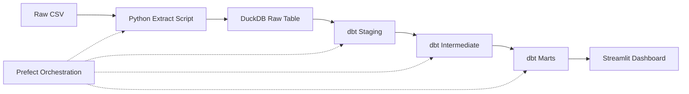

# Bank Transaction Data Pipeline & Analytics

An end-to-end data engineering pipeline that ingests raw bank transaction data, cleans and transforms it through a layered dbt project, orchestrates the full workflow with Prefect, and surfaces the results through an interactive Streamlit dashboard.

## What this project does

Raw transaction CSVs are rarely trustworthy or analysis-ready on their own. This pipeline takes 2,500+ raw bank transaction records and turns them into a tested, documented, query-ready analytics layer — answering real business questions like:

- Which customers spend the most, and what does their behavior look like?
- How is spending distributed across transaction types and channels?
- What are the month-over-month trends in transaction volume and amount?
- Which individual transactions are unusually large *for that specific customer*?

## Architecture



**The dbt layer follows a standard staging → intermediate → marts structure:**

- **Staging** (`stg_transactions`): raw data cleaned, typed, and renamed. No business logic.
- **Intermediate** (`int_customer_transaction_stats`): reusable aggregation — one row per customer, summarizing their full transaction history.
- **Marts** (final, business-facing tables):
  - `dim_customers` — customer dimension table with demographics and behavior
  - `fct_category_summary` — spending broken down by transaction type and channel
  - `fct_monthly_trends` — monthly transaction volume and spend, with month-over-month % change
  - `fct_spending_anomalies` — transactions flagged as unusually large relative to that customer's own average (z-score > 2), using each customer's personal mean and standard deviation rather than a fixed dollar threshold
Every model in the staging, intermediate, and marts layers has automated dbt tests (not_null, unique, accepted_values) — 19 tests passing across the full pipeline.

## Tech stack

| Tool | Role |
|---|---|
| Python / Pandas | Extraction |
| DuckDB | Embedded analytical database |
| dbt | SQL transformation, layered modeling, automated testing |
| Prefect | Orchestration of the full extract → transform → test workflow |
| Streamlit | Interactive analytics dashboard |

## Dataset

[Bank Transaction Dataset for Fraud Detection](https://www.kaggle.com/datasets/valakhorasani/bank-transaction-dataset-for-fraud-detection) (Kaggle) — 2,512 transaction records with customer demographics, transaction details, and behavioral fields.

## Project structure

```
bank-transaction-pipeline/
├── data/raw/                  # Raw source CSV
├── scripts/
│   ├── extract_load.py        # CSV -> DuckDB raw table
│   └── pipeline_flow.py       # Prefect orchestration flow
├── dbt_project/bank_pipeline/
│   └── models/
│       ├── staging/           # stg_transactions
│       ├── intermediate/      # int_customer_transaction_stats
│       └── marts/             # dim_customers, fct_category_summary,
│                               # fct_monthly_trends, fct_spending_anomalies
└── dashboard/
    └── app.py                 # Streamlit dashboard
```

## Running it locally

```bash
# 1. Clone and set up a virtual environment
git clone https://github.com/ojaswi-singh24/bank-transaction-pipeline.git
cd bank-transaction-pipeline
python -m venv .venv
.\.venv\Scripts\Activate.ps1          # Windows
pip install pandas duckdb dbt-duckdb prefect streamlit

# 2. Run the full pipeline (extract -> dbt run -> dbt test), orchestrated by Prefect
python scripts\pipeline_flow.py

# 3. Launch the dashboard
streamlit run dashboard\app.py
```

## What I'd build next

- Incremental loading instead of full-table replacement on every run
- Scheduled, recurring Prefect deployments instead of manual triggering
- A larger synthetic dataset to validate performance at scale